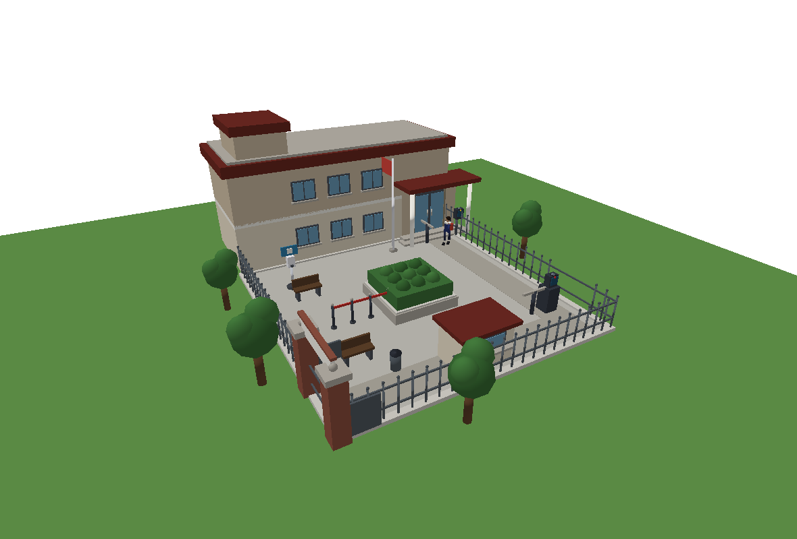
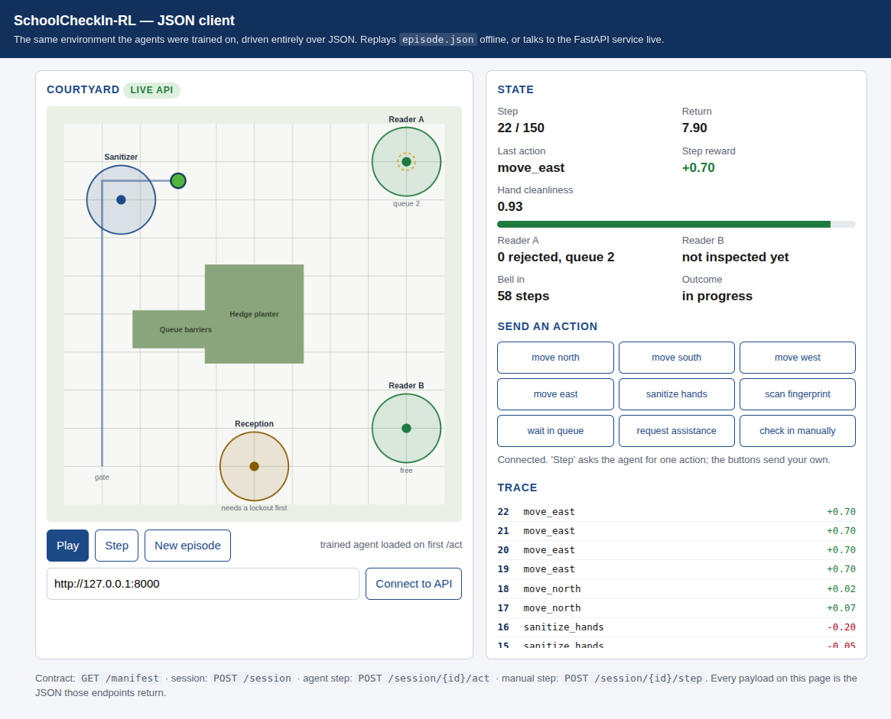
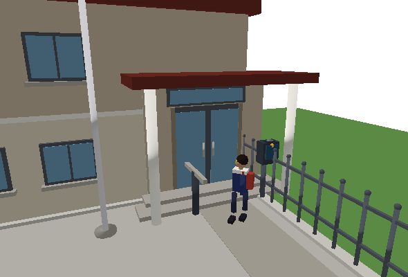
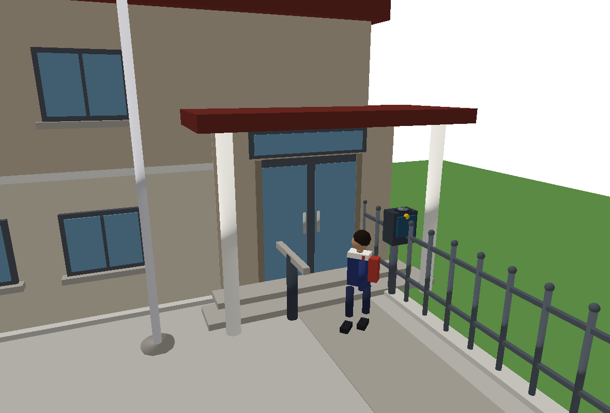
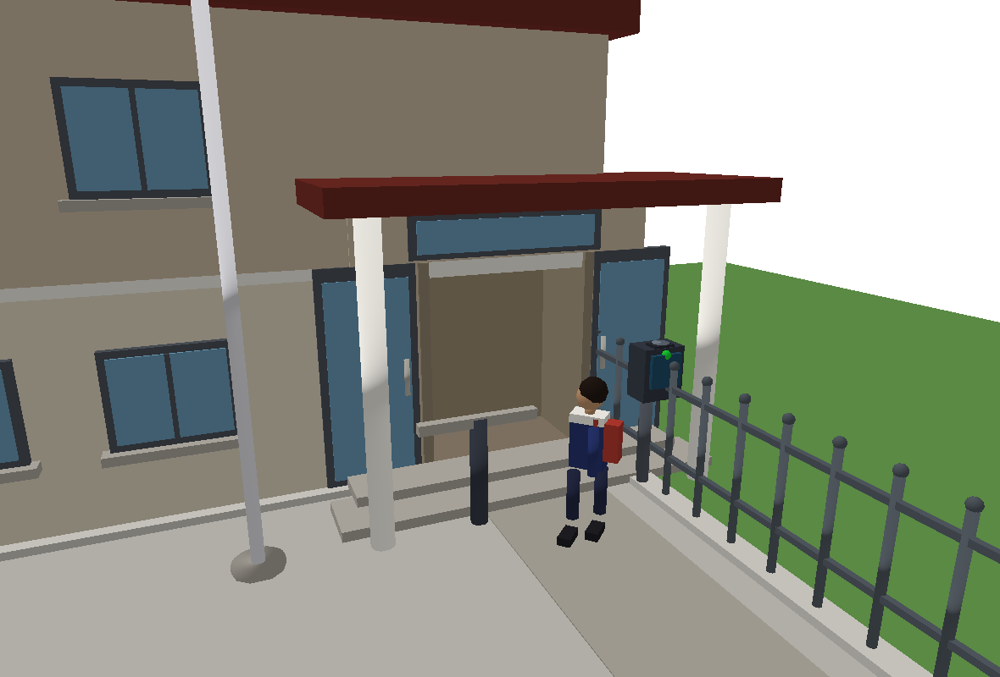

# SchoolCheckIn-RL — Reinforcement Learning for Biometric School Check-in

Reinforcement Learning summative (education mission). A custom Gymnasium environment models
a **biometric school attendance system**: a pupil arrives at the school gate and must
register attendance before the bell. The intended route is biometric — reach a fingerprint
kiosk and scan in — but the entrance is deliberately awkward, so a good policy has to plan
a multi-stage route under uncertainty rather than walk in a straight line.



Four RL algorithms are trained and compared on the **same** environment:

| Category | Algorithm | Implementation |
|---|---|---|
| Value-based | **DQN** | Stable-Baselines3 |
| Policy gradient | **REINFORCE** | custom PyTorch (not in SB3) |
| Policy gradient | **PPO** | Stable-Baselines3 |
| Actor-critic | **A2C** | Stable-Baselines3 |

## What makes the task hard

| Mechanic | Why it matters |
|---|---|
| **Hygiene station is a place, not a free action** | The scanner only reads a clean finger, and hands can only be washed at a fixed sanitizer stand. Checking in is a two-stage route (detour to sanitize → cross to a kiosk), not a greedy walk. |
| **Two kiosks** | Scanner A (main door) is reliable; scanner B (east side gate) is closer to the gate but flaky, and is out of order 25% of the time. |
| **Partial observability** | Whether scanner B is broken is hidden until the pupil is within 2.5 m of its display. |
| **Per-kiosk lockout** | Three rejections lock *that* kiosk, not the episode, so the pupil must re-plan to the other kiosk, call staff, or fall back to reception. |
| **Queues** | During the morning rush each kiosk is intermittently occupied; scanning a busy one wastes the step, so `wait_in_queue` is the correct action. |
| **Gated manual fallback** | Reception hand-signs a pupil **only** after a kiosk has locked them out, for a much smaller reward. Without the precondition every algorithm just walks to reception (measured: PPO converged to 100% manual sign-in in 9 steps). |
| **Contamination** | Bumping the hedge planter or the queue barriers dirties the hands, so collisions carry a downstream cost. |
| **The bell** | Checking in before step 80 earns a punctuality bonus; after it the pupil is tardy and the reward is cut. |

## Requirements
This project uses **[uv](https://docs.astral.sh/uv/)** for dependency and environment management.
No manual `pip install` or venv creation is needed.

```bash
uv sync                 # create the venv and install everything
```

## Quick start
```bash
uv run main.py demo                 # random-policy 3D GUI demo (no training needed)
uv run main.py train --algo all     # run all four hyperparameter sweeps (10 runs each)
uv run main.py evaluate             # print the best config per algorithm
uv run main.py plots                # regenerate report figures into assets/
uv run main.py play                 # visualise the best agent in the PyBullet GUI
uv run play.py --algo ppo --model ppo02   # play a specific saved model
```

Faster smoke tests (short training, no save):
```bash
uv run python -m training.dqn_training --quick
uv run python -m training.pg_training --quick
uv run --extra dev pytest            # environment sanity tests
```

Unattended full pipeline (four sweeps in parallel, then figures):
```bash
bash scripts/run_pipeline.sh
```

### JSON API and web client (frontend integration)
```bash
uv run main.py export                # write web/manifest.json + web/episode.json
uv run main.py serve                 # API + demo client on http://127.0.0.1:8000/app/
```

The environment is fully serialized to JSON, so a web or mobile product can consume it
without importing any Python:

| Endpoint | Returns |
|---|---|
| `GET /manifest` | the whole contract: 29-feature observation layout with index ranges, the nine actions, every reward constant, the dynamics and the scene geometry |
| `GET /layout` | scene geometry only, for rendering |
| `POST /session` | a session id and the initial state (optional `seed`, `cleanliness`, `scan_reliability`, `scanner_b_broken`, `rush`) |
| `POST /session/{id}/step` | applies a client-chosen action, returns the next state |
| `POST /session/{id}/act` | the **best trained agent** picks and applies one action |
| `GET /session/{id}`, `DELETE /session/{id}` | read / end a session |
| `GET /docs`, `GET /openapi.json` | interactive and machine-readable OpenAPI, so a mobile client can generate typed models |

Every state payload carries the raw 29-d observation alongside the human-readable fields,
so a client can run its own model on exactly the vector the agents were trained on. CORS is
open, so a Vite, Expo or React Native client on another origin can call the service
directly.

[`web/index.html`](web/index.html) is a dependency-free client (canvas, plain fetch) served
at `/app/`. It replays `web/episode.json` offline and switches to the live API on
**Connect**, driving the trained agent through `POST /session/{id}/act`.



## Environment summary
- **Observation** (`Box`, 29-d, in [-1, 1]): position; vector + distance to each of scanner A,
  scanner B, the sanitizer and reception; at-station flags; hand cleanliness; per-kiosk
  rejection counts and lockout flags; scanner-B health belief (0 until inspected); observed
  queue lengths; time left; time to the bell; whether reception will accept a manual sign-in.
- **Actions** (`Discrete(9)`): move north / south / west / east, `sanitize_hands`,
  `scan_fingerprint`, `wait_in_queue`, `request_assistance`, `check_in_manually`.
- **Rewards**: potential-based route shaping, a per-step cost, penalties for bumping,
  misusing a station, busy/locked/failed scans and lockout; **+20** for a biometric check-in
  and **+5** for a manual one, plus a punctuality bonus or a tardiness penalty; penalties for
  being stranded or never checking in.
- **Start**: at the main gate with randomised hand cleanliness and hidden kiosk health.
- **Terminal**: biometric check-in, manual sign-in at reception, stranded (all routes
  exhausted), or timeout at 150 steps.

> **Reward shaping note.** Shaping is strictly potential-based — `Φ(s') − Φ(s)` over a
> single route-length potential — so every closed loop in state space sums to zero. An
> earlier version rewarded progress toward the *current* sub-goal; because the sub-goal
> flipped as the hands got dirty, PPO learned to shuttle between the sanitizer and the
> kiosk forever, scoring **+40 with a 0% check-in rate**. `tests/test_env.py` pins this shut.

## Visualization



PyBullet renders the entrance as a real school: a two-storey classroom block with framed
windows, sills and a parapet roof; a glazed entrance portico with canopy, columns and
steps; a fenced courtyard with brick gate piers, a paved path, lawn, trees, benches and a
flagpole; the sanitizer stand, reception booth, hedge planter and queue barriers.

The pupil is articulated — head, hair, uniform, backpack, swinging arms and legs, shoes —
turns to face the direction of travel, and walks with a gait tied to distance covered. Its
**scanning hand is tinted by cleanliness**, so the sanitize detour is visible at a glance.

**On a successful fingerprint scan at the main entrance the doors slide open and the pupil
walks into the school**, then the doors close behind them; at the side gate the turnstile
arm swings clear instead. Reader lamps are colour-coded live — red idle, amber in use, blue
queued, grey out of order, green admitted.

| Doors closed, presenting a finger | Admitted — doors open onto the lobby |
|---|---|
|  |  |

## Project structure
```
├── main.py                  # CLI entry (train / play / demo / evaluate / plots)
├── play.py                  # GUI playback of the best agent, verbose terminal output
├── environment/             # custom_env.py (Gym env) + rendering.py (PyBullet 3D)
├── training/                # dqn_training.py, pg_training.py, plots.py, common.py
├── api/                     # schema.py (JSON contract), serve.py (FastAPI), export.py
├── web/                     # dependency-free client + exported manifest.json / episode.json
├── scripts/run_pipeline.sh  # unattended parallel training + figures
├── models/{dqn,pg}/         # saved models
├── logs/                    # per-run monitor/progress CSVs + TensorBoard
├── assets/                  # report figures & screenshots
└── tests/                   # env sanity tests
```

## Report figures (`assets/`)
| File | Shows |
|---|---|
| `reward_curves.png` | episode reward per algorithm, best config |
| `convergence.png` | smoothed best curve of each algorithm, overlaid |
| `dqn_objective.png` | DQN TD loss and mean episode reward |
| `pg_entropy.png` | policy entropy for REINFORCE / PPO / A2C |
| `generalization.png` | check-in rate across unseen scanner reliabilities |
| `checkin_modes.png` | biometric vs manual vs no check-in, per algorithm |
| `env_screenshot.png` | wide view of the school and courtyard |
| `entrance_closed.png` / `entrance_open.png` | the doors before and after a successful scan |
| `checkin_entry.gif` | scan → doors open → pupil walks in |
